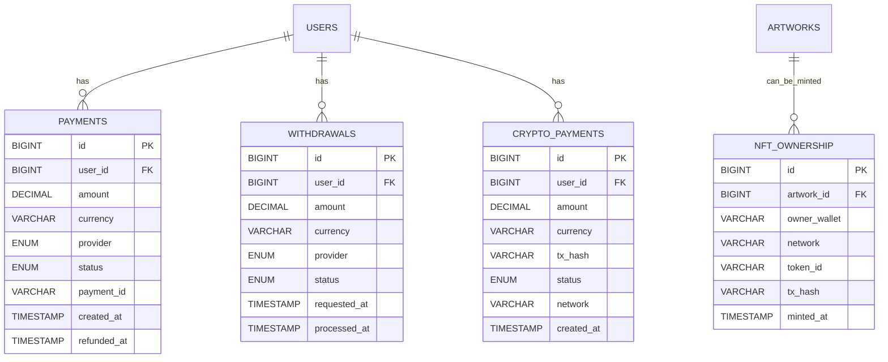
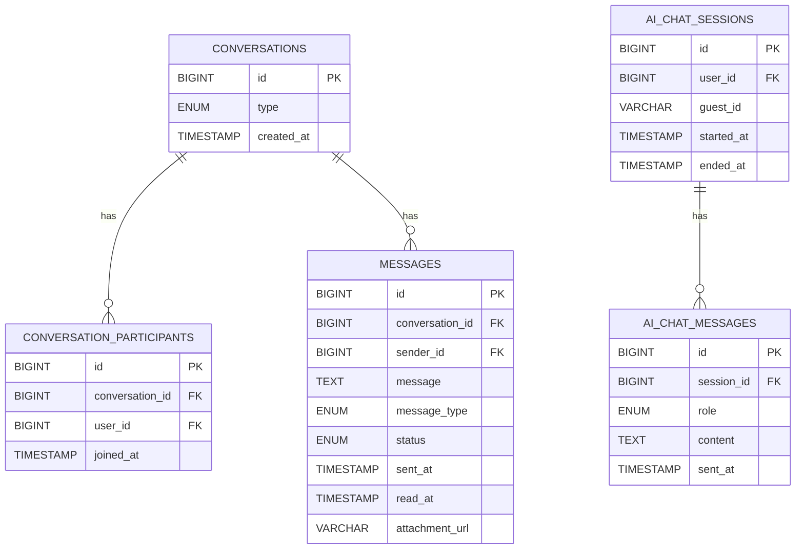
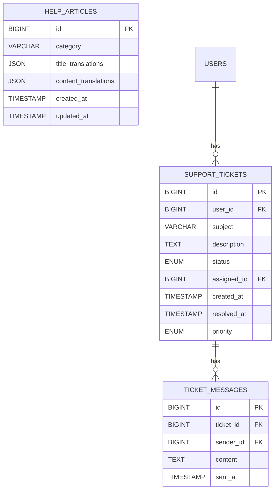
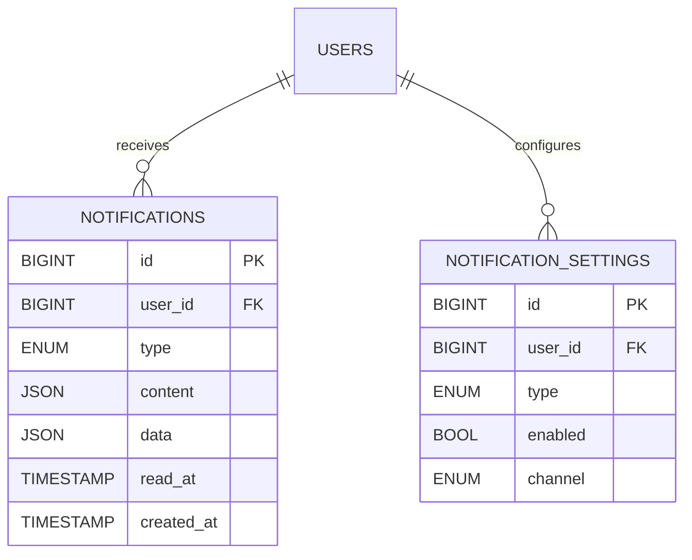
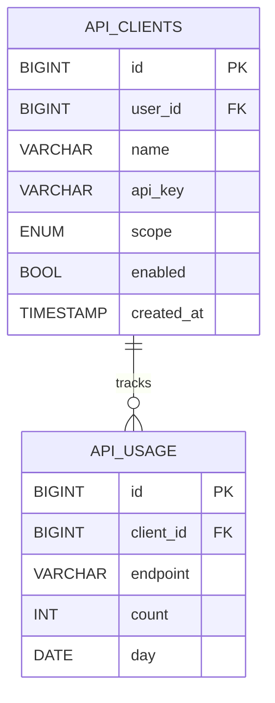
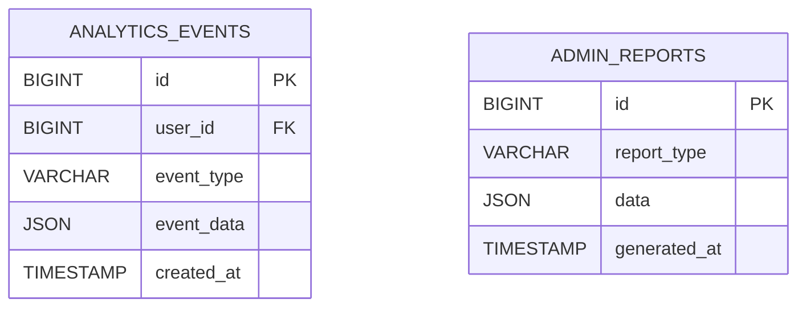

# Acumen Craft – მოწინავე მოდულების ERD & UI Mockup-ების გზამკვლევი

---

## 1. სოციალური და მობილური ავთენტიფიკაცია

### **ERD**

```mermaid
erDiagram
    USERS {
      BIGINT id PK
      VARCHAR name
      VARCHAR email
      VARCHAR password
      VARCHAR provider
      VARCHAR provider_id
      VARCHAR oauth_avatar
      BOOL oauth_email_verified
      VARCHAR 2fa_secret
      ...
    }
    LINKED_ACCOUNTS {
      BIGINT id PK
      BIGINT user_id FK
      VARCHAR provider
      VARCHAR provider_id
      VARCHAR email
      VARCHAR avatar_url
      TIMESTAMP created_at
    }
    USERS ||--o{ LINKED_ACCOUNTS : has
```

### **UI Mockup (Textual Sketch)**

- **Login/Register Page**:  
  [ Google ] [ Apple ] [ Facebook ]  
  —or—  
  Email/Password  
  [ 2FA Code (optional) ]  
  [ Link other accounts ]  
  [ Reset password ]  
  [ Privacy Policy ]

- **Profile > Linked Accounts**:  
  - Google: ✅ Linked | [ Unlink ]  
  - Apple: [ Link ]  
  - Facebook: [ Link ]  
  - 2FA: [ Setup ] [ Regenerate Backup Codes ]

---

## 2. გადახდები: Fiat & კრიპტო

### **ERD**



### **UI Mockup (Textual Sketch)**

- **Payments:**  
  - [Pay by Card] [PayPal] [Crypto]  
  - Amount: $___  
  - [ Checkout ]

- **Withdrawals:**  
  - Balance: $___  
  - [Withdraw] (choose method: Stripe, PayPal, Crypto)

- **NFT Mint:**  
  - [ Connect Wallet ]  
  - [ Mint as NFT ]  
  - [ View on Explorer ]

---

## 3. ლაივ ჩატი (User2User, Guest, AI)

### **ERD**



### **UI Mockup (Textual Sketch)**

- **Inbox:**  
  - [User1] [AI Assistant] [New Chat]  
  - Conversation List

- **Chat Window:**  
  - Messages  
  - [Type message...] [Send] [Attach]

- **AI Chat Widget:**  
  - "Ask AI"  
  - [Suggested Prompts]  
  - [👍] [👎]

---

## 4. HelpDesk & Guided Tour

### **ERD**



### **UI Mockup (Textual Sketch)**

- **Help Center:**  
  - [Search FAQ...]  
  - Categories: Uploading, Payments, Copyright...
  - [Contact Support] (opens ticket form)

- **Ticket View:**  
  - Subject  
  - Messages thread  
  - [Reply]

- **Onboarding Tour:**  
  - "Welcome to Acumen Craft!"  
  - [Next Step] [Skip]

---

## 5. Notification System

### **ERD**



### **UI Mockup (Textual Sketch)**

- **Header:**  
  - [🔔] (shows dropdown with latest notifications)

- **Notification Center:**  
  - All, Unread, Settings  
  - [Mark all as read]

- **Settings:**  
  - Email, Push, In-app toggles for each event type

---

## 6. Privacy & Security

### **ERD**

```mermaid
erDiagram
    USERS {
      ... (as above)
      JSON notification_prefs
      JSON privacy_prefs
    }
    SECURITY_LOGS {
      BIGINT id PK
      BIGINT user_id FK
      VARCHAR action
      VARCHAR ip
      TEXT meta
      TIMESTAMP created_at
    }
    USERS ||--o{ SECURITY_LOGS : records
```

### **UI Mockup (Textual Sketch)**

- **Privacy Dashboard:**  
  - [Download my data] [Erase account]  
  - [Manage consents]  
  - [Public/Private profile toggle]

- **Security:**  
  - [Enable 2FA]  
  - [Active devices]  
  - [Session history]  
  - [Logout all devices]

---

## 7. API Exposure & Integration

### **ERD**



### **UI Mockup (Textual Sketch)**

- **API Key Management:**  
  - [Generate API Key]  
  - [View Usage]  
  - [Revoke]

---

## 8. Analytics & Insights

### **ERD**



### **UI Mockup (Textual Sketch)**

- **Admin Dashboard:**  
  - [User Growth Chart] [Active Users]  
  - [Artwork Stats]  
  - [Export CSV/Excel]

- **User Dashboard:**  
  - My Uploads  
  - My ACQ  
  - My Financials

---

## 9. Mobile-first & PWA

**ERD-ში ცვლილება არ მოითხოვს, უბრალოდ დიზაინის და API-ს მხარეა**.

### **UI Mockup (Textual Sketch)**

- **Mobile Navbar:**  
  - [Home] [Explore] [Upload] [Notifications] [Profile]

- **Mobile Upload:**  
  - Select/Take Photo  
  - Fill in details  
  - [Submit]

- **Push notifications:**  
  - OS-native permission prompts  
  - In-app notification banner

---

## 10. საავტორო უფლებები და infringement

**იხილე დეტალურად: [TECHNICAL_SPEC_COPYRIGHT_MODULE.md](./TECHNICAL_SPEC_COPYRIGHT_MODULE.md)**

---

## შენიშვნები

- ყველა Mermaid.js დიაგრამა შეგიძლია გრაფიკულად გარდაქმნა [Mermaid Live Editor](https://mermaid.live/)–ში ან VS Code Mermaid Extensions-ით.
- ყველა UI mockup მოცემულია ტექსტური ფორმით, მაგრამ შეგიძლია გადაიტანო Figma/Balsamiq–ში ან გამოიყენო Copilot-თან ერთად დიზაინისთვის.
- მონაცემთა მოდელში ყველა ცხრილი/ველები შეგიძლია პირდაპირ გამოიყენო Laravel/Eloquent მიგრაციებში ან სხვა ORM-ში.

---

**თუ გჭირდება რომელიმე ბლოკის სრული კოდი (მიგრაცია, controller, Vue/React კომპონენტი, Mermaid-სქემა SVG-დ), მომწერე კონკრეტულად!**
